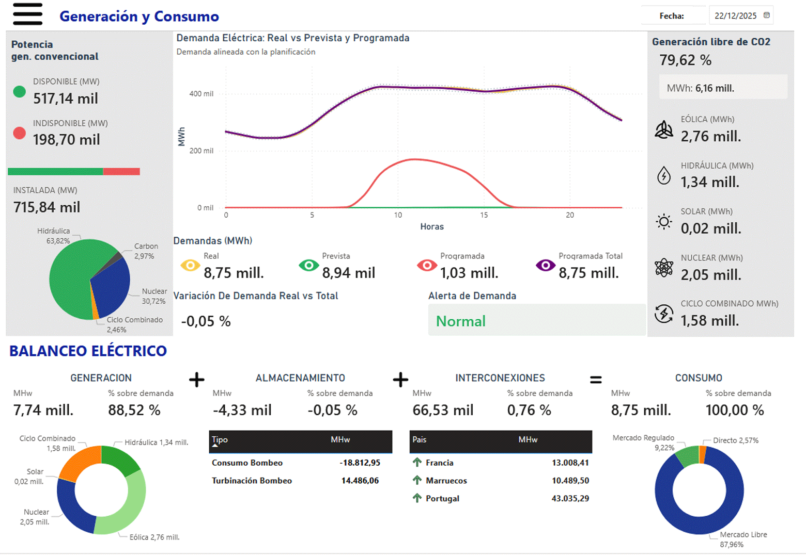
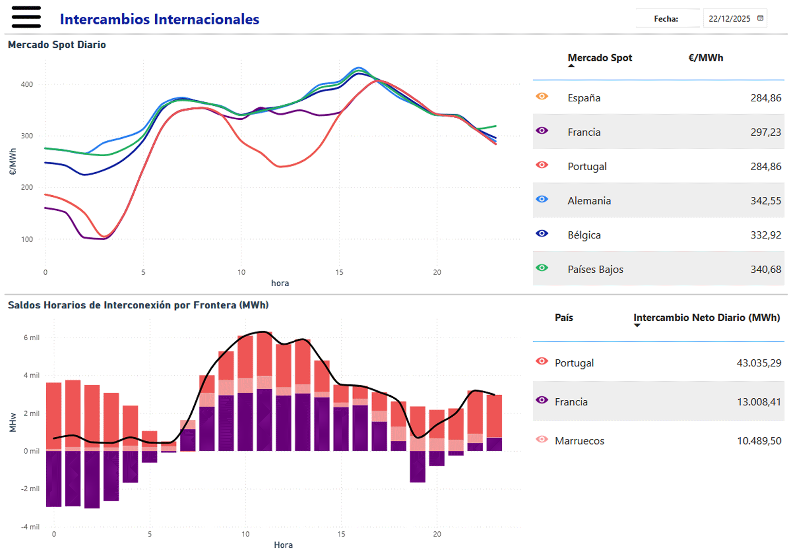
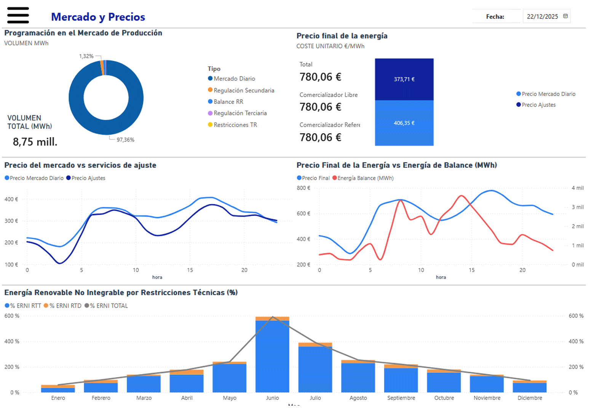

# Análisis del Mercado Eléctrico en España — Datos ESIOS

## Descripción del proyecto

Este proyecto desarrolla un sistema completo de análisis del mercado eléctrico español utilizando datos abiertos de **ESIOS (Red Eléctrica de España)**.

El objetivo es construir un **pipeline de datos end-to-end** que permita:

- Descargar datos desde la API de ESIOS
- Procesarlos y modelarlos en Python
- Construir un modelo analítico en Power BI
- Visualizar indicadores clave del sistema eléctrico

El resultado es un **dashboard interactivo profesional** orientado a la toma de decisiones y análisis energético.

---

## Objetivos del proyecto

- Construir un **Data Pipeline automatizado**
- Diseñar un **modelo de datos tipo estrella**
- Analizar el comportamiento del sistema eléctrico
- Visualizar KPIs energéticos clave
- Aplicar buenas prácticas de **Data Analytics y BI**

---

## Alcance analítico

El proyecto cubre las principales áreas del sistema eléctrico español, integrando visualizaciones interactivas que permiten analizar la operación, el mercado y el balance energético.

---

### Generación y Consumo

Incluye el análisis integral de la demanda eléctrica y la generación energética:

- Demanda real vs prevista vs programada  
- Identificación de desviaciones y alertas de consumo  
- Mix de generación por tecnología (renovable y no renovable)  
- Indicadores clave de generación libre de CO₂  
- Balance eléctrico: generación + almacenamiento + interconexiones = consumo  

---

### Intercambios Internacionales

Permite analizar el comportamiento del sistema eléctrico en el contexto europeo:

- Flujos de energía con Francia, Portugal y Marruecos  
- Saldos horarios de interconexión  
- Comparativa de precios spot entre países  
- Identificación de importaciones/exportaciones netas  

---

### Mercado y Precios

Se enfoca en el análisis económico del sistema eléctrico:

- Precio del mercado diario y servicios de ajuste  
- Precio final de la energía  
- Relación entre precio y energía de balance  
- Programación del mercado de producción  
- Energía renovable no integrable (ERNI) y restricciones técnicas  

---

### Enfoque del análisis

El dashboard permite:

- Navegación dinámica por fecha mediante selector tipo *date picker*  
- Análisis horario detallado del sistema eléctrico  
- Identificación de patrones operativos y anomalías  
- Visualización integrada de generación, consumo, mercado e interconexiones  

---

### 📊 Valor del proyecto

Este análisis proporciona una visión completa del sistema eléctrico, permitiendo:

- Comprender el equilibrio entre oferta y demanda  
- Analizar el impacto de las energías renovables  
- Evaluar el comportamiento del mercado eléctrico  
- Detectar oportunidades de optimización y eficiencia energética  

---

## Arquitectura del proyecto

### 🔄 Pipeline de datos

ESIOS API

↓

Descarga (Python)

↓

Procesamiento (Pandas)

↓

Parquet (Data Lake local)

↓

Modelo Power BI

↓

Dashboard

---

## Estructura del proyecto

├── config/

│ ├── config.py # Configuración API (token)

│ ├── indicadores.py # Catálogo de indicadores ESIOS

│

├── scripts/

│ ├── esios_downloader.py # Descarga anual

│ ├── esios_downloader_mensual.py # Descarga mensual

│ ├── build_fact_energia_full_v2.py # Fact principal

│ ├── build_fact_precio_spot.py # Fact precios internacionales

│

├── data/

│ ├── raw/ # Datos crudos (parquet)

│ ├── processed/ # Tablas finales

│

├── powerbi/

│ └── dashboard.pbix # Dashboard principal

│

├── docs/

│ └── diccionario_datos # Documentación del modelo

│

├── dashboards/

│ └── screenshots # Capturas del dashboard

│

└── README_data.md # Guía del pipeline

---

## 📊 Modelo de datos

El modelo sigue una estructura tipo **star schema**:

### Tablas de hechos

- `fact_energia_full_v2`
  - Demanda
  - Generación
  - Precios
  - Interconexiones
  - Servicios del sistema
  - ERNI

- `fact_precio_spot`
  - Precios eléctricos por país

### Dimensiones

- `Dim_Calendario`
- `Dim_Hora`
- `Dim_Pais`

---

## ⚙️ Pipeline de datos

### 1. Configurar token ESIOS

Editar: config/config.py

---

### 2. Descargar datos

python -m scripts.esios_downloader

o (modo mensual):

python -m scripts.esios_downloader_mensual

---

### 3. Construir tablas

python -m scripts.build_fact_energia_full_v2

python -m scripts.build_fact_precio_spot

---

## Visualizaciones desarrolladas

El dashboard incluye:

### 🔹 Mercado y precios
- Precio mercado vs ajustes
- Precio final vs energía de balance
- Distribución del mercado eléctrico

### 🔹 Energía renovable
- ERNI (energía no integrable)
- Desglose RTT / RTD / Tiempo real

### 🔹 Intercambios internacionales
- Mercado spot por país
- Comparativa de precios europeos
- Saldos horarios de interconexión

### 🔹 Sistema eléctrico
- Balance energético
- Generación vs consumo
- Almacenamiento y bombeo

---

## Lógica analítica clave

- Energía → agregación por SUM
- Precios → agregación por AVERAGE
- Indicadores porcentuales → media temporal
- Interconexiones → cálculo de saldos (export - import)

---

## Nivel del proyecto

Este proyecto integra:

- Data Engineering (ETL con Python)
- Data Modeling (modelo estrella)
- Business Intelligence (Power BI)
- Análisis del sector energético

---

## Posibles mejoras

- Automatización completa del pipeline (cron / airflow)
- Integración con cloud (BigQuery / Azure)
- Modelos predictivos (ML)
- Datos en tiempo real (ESIOS streaming)
- API propia para consumo del dashboard

---

## 📚 Fuente de datos

ESIOS — Red Eléctrica de España  
https://www.esios.ree.es

Este proyecto utiliza datos abiertos provenientes de ESIOS (Red Eléctrica de España).

Los datos no son propiedad del autor y su uso está sujeto a las condiciones de uso de ESIOS:
https://www.esios.ree.es

Este repositorio contiene únicamente el código y la lógica de procesamiento.

---

## 👤 Autor

Juan Manuel Pérez  
Analista de Datos | Business Intelligence | Ciencia de Datos  

🔗 LinkedIn:  
https://www.linkedin.com/in/juan-manuel-p%C3%A9rez-garc%C3%ADa-bigdata/

---

## Nota

Este proyecto utiliza datos abiertos públicos.  
El enfoque es educativo, analítico y profesional.

